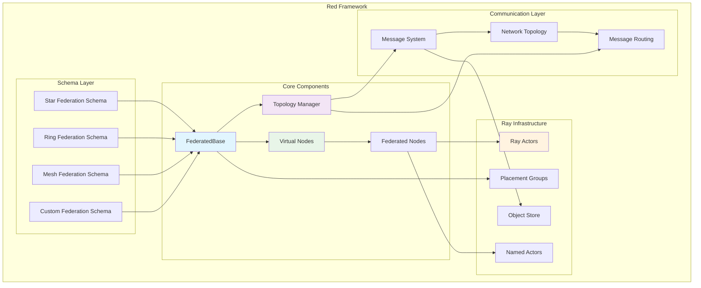
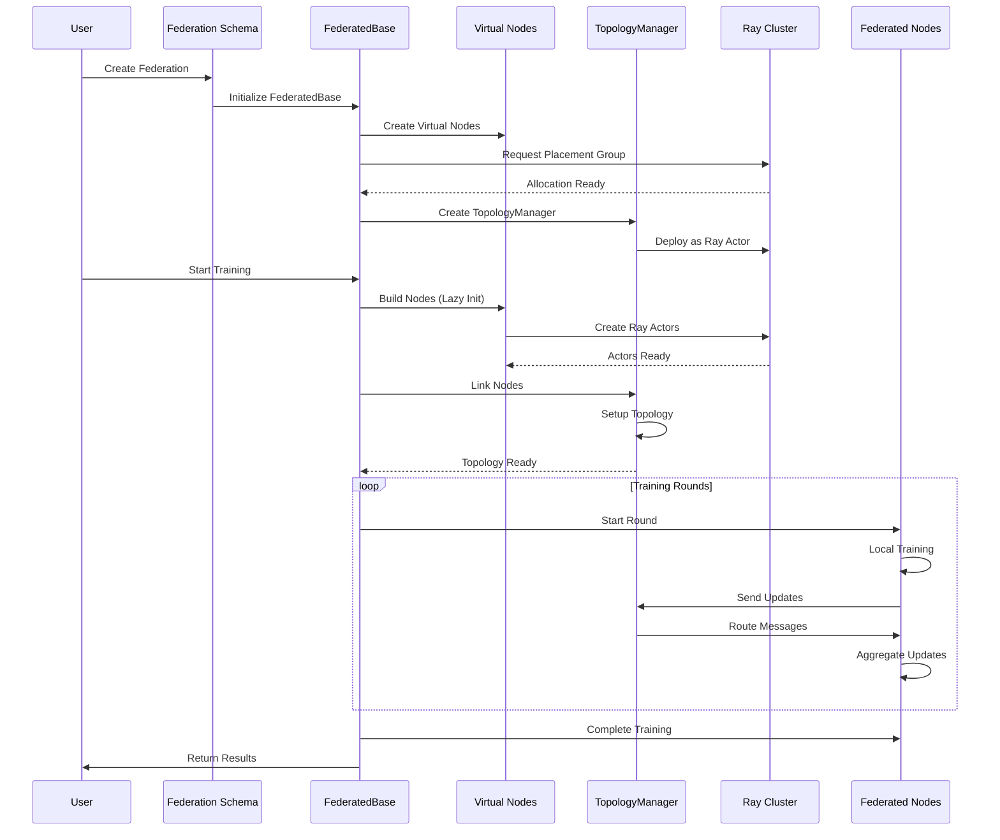
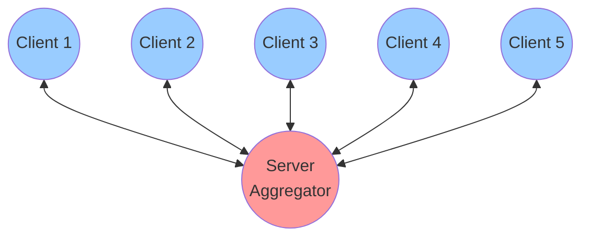
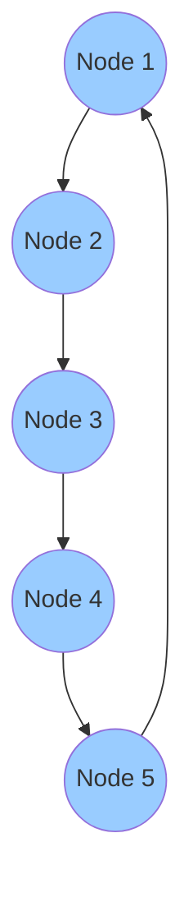
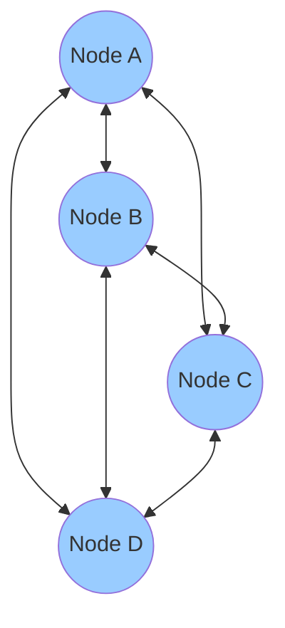
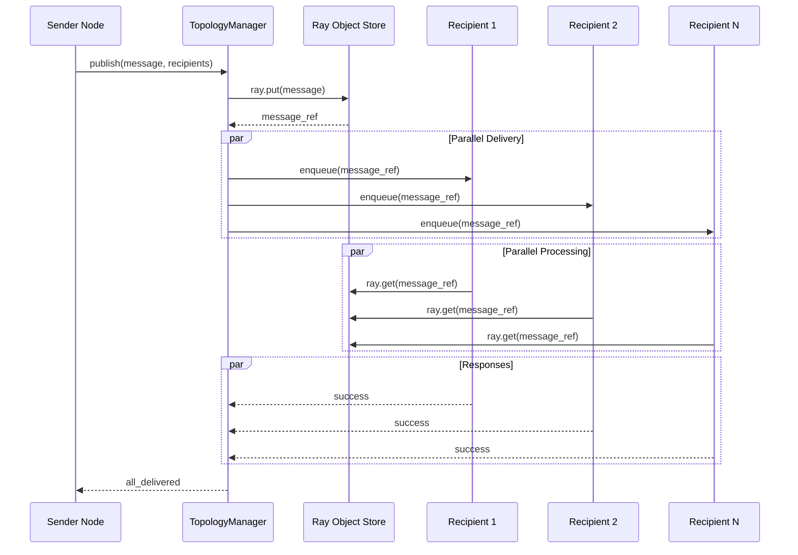
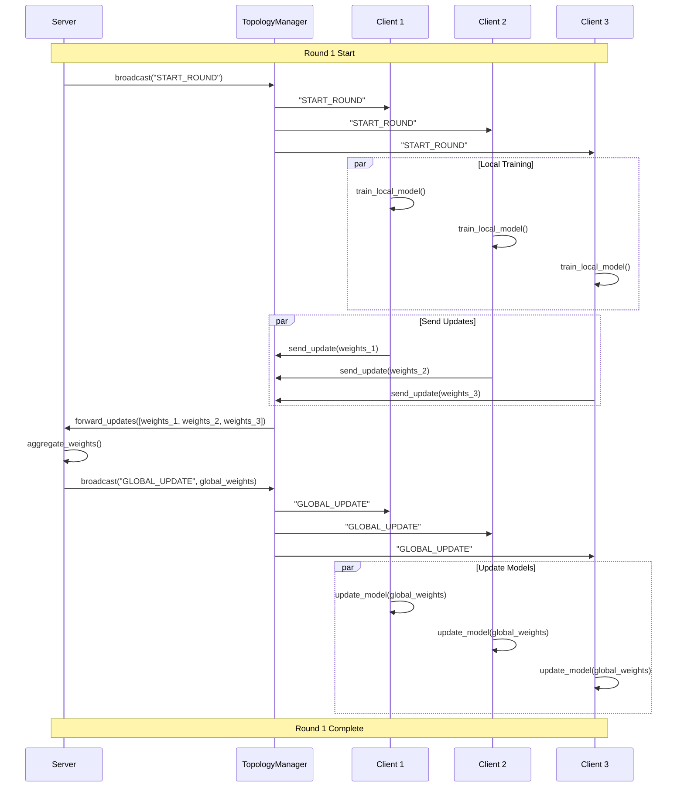

# Red Architecture Diagrams: Visual Guide to Federated Learning

This visual guide provides comprehensive diagrams showing how Red's federated learning framework operates, from high-level architecture to detailed component interactions.

## 🏗️ High-Level System Architecture

The overall Red framework architecture shows the relationship between major components. This diagram illustrates how the different layers interact to provide a complete federated learning solution:

- **Schema Layer**: Different federation types (Star, Ring, Mesh, Custom)
- **Core Components**: Foundation classes and node management
- **Ray Infrastructure**: Distributed computing backbone
- **Communication Layer**: Message passing and networking



## 🌟 Federation Lifecycle Flow

This sequence diagram shows the complete lifecycle of a federation from creation to completion. It demonstrates how Red orchestrates the entire federated learning process:

1. **Initialization**: Federation schema creates the base framework
2. **Resource Allocation**: Ray placement groups are requested and allocated
3. **Node Creation**: Virtual nodes are built into Ray actors when training starts
4. **Topology Setup**: Communication patterns are established
5. **Training Loop**: Iterative federated learning rounds
6. **Completion**: Results are returned to the user



## 🌐 Network Topology Patterns

Red supports multiple communication topologies, each optimized for different use cases:

### Star Topology
The star topology features centralized communication through a server node. This is ideal for:
- Traditional federated learning algorithms (FedAvg)
- Scenarios requiring central coordination
- Simpler deployment and management



### Ring Topology
The ring topology enables peer-to-peer communication in a circular pattern. Benefits include:
- Decentralized learning algorithms
- Reduced communication bottlenecks
- Better fault distribution



### Mesh Topology
In mesh topology, every node can communicate with every other node, providing:
- Maximum flexibility for research algorithms
- Redundant communication paths
- High fault tolerance



## 📡 Message Passing System

Red's efficient message passing system leverages Ray's object store for optimal performance. The diagram shows:

1. **Single Serialization**: Messages are serialized once using `ray.put()`
2. **Parallel Delivery**: Message references are sent to all recipients simultaneously
3. **Efficient Retrieval**: Recipients fetch messages from the shared object store
4. **Confirmation**: Delivery confirmations are collected in parallel



This approach provides significant performance benefits:
- **Memory Efficiency**: Single copy of large messages in object store
- **Network Optimization**: Only references transmitted, not full data
- **Scalability**: Parallel delivery to multiple recipients

## 🎯 Virtual Node Architecture

The Virtual Node system enables efficient resource management through lazy initialization:

```python
# Virtual nodes created instantly (no resources)
virtual_nodes = [
    VirtualNode(ClientNode, f"client_{i}", "train", config, log)
    for i in range(100)  # Creates 100 virtual nodes instantly
]

# Actual Ray actors created only when needed
federation.train()  # Now resources are allocated and actors built
```

### Benefits of Virtual Nodes:
- **Fast Federation Setup**: Instant creation without resource allocation
- **Memory Efficiency**: No resources consumed until training starts
- **Dynamic Scaling**: Add/remove nodes based on actual needs
- **Resource Optimization**: Only allocate what's required for training

## ⚡ Ray Integration Architecture

Red's integration with Ray provides production-grade distributed computing capabilities:

### Key Ray Features Used:
1. **Named Actors**: Hierarchical naming (`federation_id/node_id`) for service discovery
2. **Placement Groups**: Resource co-location and allocation guarantees
3. **Object Store**: Efficient sharing of large model parameters
4. **Actor Supervision**: Automatic failure detection and restart

### Resource Management:
```python
# Placement group creation
placement_group = ray.util.placement_group([
    {"CPU": 2},          # TopologyManager bundle
    {"CPU": 4, "GPU": 1}, # High-resource client bundle
    {"CPU": 2, "GPU": 0.5}, # Medium-resource client bundle
    {"CPU": 1, "GPU": 0}  # CPU-only client bundle
], strategy="PACK")
```

## 📊 Federated Learning Training Flow

A complete training round in a star topology follows this pattern:

1. **Round Initiation**: Server broadcasts start signal
2. **Local Training**: Clients train on local data in parallel
3. **Update Sharing**: Clients send model updates to server
4. **Aggregation**: Server combines updates into global model
5. **Distribution**: Global model broadcast to all clients
6. **Model Update**: Clients update their local models

This process repeats for the specified number of rounds, enabling distributed learning while keeping data localized.



## 🔧 Advanced Features

### Resource Management
Red automatically optimizes resource allocation based on:
- Available cluster resources (CPU/GPU)
- Number of federation participants
- Training requirements and complexity

### Fault Tolerance
Multi-level fault tolerance ensures reliability:
- **Ray Level**: Actor supervision and automatic restart
- **Application Level**: Graceful degradation and topology rebalancing
- **Communication Level**: Message retry and alternative routing

### Performance Optimization
- **Placement Strategies**: PACK for low latency, SPREAD for fault tolerance
- **Message Batching**: Combine multiple operations for efficiency
- **Resource Monitoring**: Real-time tracking of cluster utilization

## 📈 Scaling Characteristics

Red scales efficiently across different deployment sizes:

### Small Scale (4-8 nodes)
- Single machine deployment
- Direct communication patterns
- Simplified topology management

### Medium Scale (16-32 nodes)
- Multi-machine clusters
- Optimized placement strategies
- Batched message operations

### Large Scale (64+ nodes)
- Distributed cluster deployment
- Hierarchical communication patterns
- Advanced resource management

## 🛡️ Production Features

### Monitoring and Observability
- Ray Dashboard integration for cluster monitoring
- Custom metrics collection for federation health
- Real-time performance tracking

### Configuration Management
- Flexible configuration system
- Environment-specific settings
- Dynamic parameter adjustment

### Security and Privacy
- Secure message passing
- Data locality preservation
- Authentication and authorization support

---

These diagrams provide a comprehensive visual understanding of how Red's federated learning framework operates at every level. The combination of Ray's distributed computing capabilities with Red's federated learning abstractions creates a powerful platform for production-grade federated learning deployments.

## 🔗 Related Documentation

- **[Getting Started]()**: Begin using Red
- **[Ray Integration Deep Dive]()**: Advanced Ray usage
- **[Architecture Overview]()**: Detailed system design
- **[API Reference]()**: Complete API documentation 