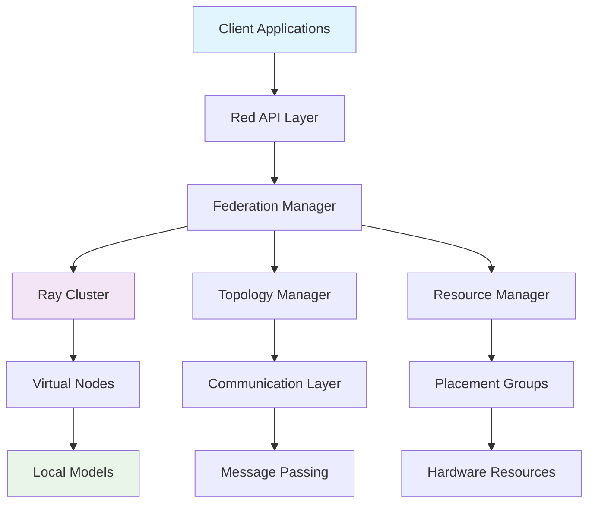
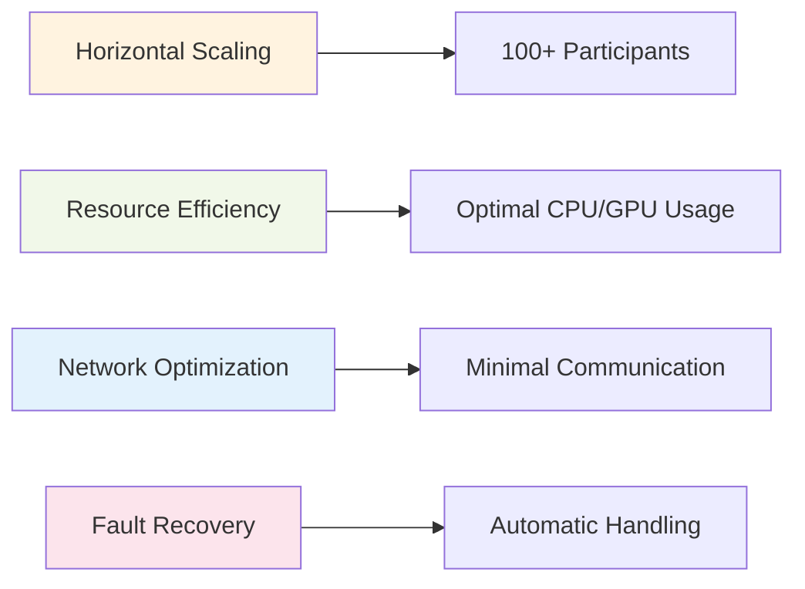

# Red: Production-Grade Federated Learning Framework

Red is a cutting-edge, production-ready federated learning system built on top of Ray for scalable distributed machine learning. It enables organizations to collaborate on machine learning models while keeping their data private and secure.

## 🚀 Overview

Red provides a comprehensive framework for federated learning that combines the power of Ray's distributed computing with advanced federated learning algorithms. Our system is designed for production environments and can scale to handle hundreds of participants.

## 💡 Key Features

- **Ray-Powered Distribution**: Efficient federated learning through Ray's distributed computing
- **Flexible Topologies**: Star, ring, mesh, and custom network configurations  
- **Virtual Node Architecture**: Advanced resource management with lazy initialization
- **Production Ready**: Enterprise-grade reliability and scalability
- **Multiple FL Schemas**: Support for various federated learning approaches

## Architecture Overview

Here's a high-level view of the Red framework architecture:

## Core Components

### 🏗️ Federated Base
The foundation class for all federated learning implementations, providing core functionality and lifecycle management.

### 🔄 Virtual Nodes  
Lazy-initialized node wrappers that optimize resource management and enable efficient scaling.

### 🌐 Topology Manager
Handles network communication and node relationships, supporting various network topologies.

### 📊 Federated Node
Individual participant nodes in the federation, managing local model training and updates.

## Ray Integration

Red leverages Ray's powerful distributed computing capabilities:

- **Remote Execution**: All nodes run as Ray remote actors
- **Resource Management**: Optimal resource allocation through placement groups  
- **Message Passing**: Efficient inter-node communication
- **Fault Tolerance**: Built-in resilience through Ray's supervision
- **Scalability**: Dynamic scaling across multiple machines

## Performance Benefits

## Use Cases

- **Distributed Machine Learning**: Train models across multiple data sources
- **Privacy-Preserving AI**: Keep data localized while sharing model updates  
- **Edge Computing**: Deploy federated learning on IoT and edge devices
- **Multi-Organization Collaboration**: Enable secure ML collaboration

## Getting Started

Ready to build production-grade federated learning systems? Check out our documentation:

- [Quick Start Guide]({{ site.baseurl }}/getting-started/)
- [Architecture Deep Dive]({{ site.baseurl }}/architecture/) 
- [API Reference]({{ site.baseurl }}/api-docs/)
- [Examples & Tutorials]({{ site.baseurl }}/examples/)

## Community & Support

- 🐛 [Report Issues](https://github.com/mmroshani/red/issues)
- 💬 [Discussions](https://github.com/mmroshani/red/discussions)  
- 📧 [Contact Us](mailto:mohammadmojtabaroshani@outlook.com)
- 🌟 [Star on GitHub](https://github.com/mmroshani/red)

---

*Red Framework - Enabling secure, scalable federated learning for everyone.* 