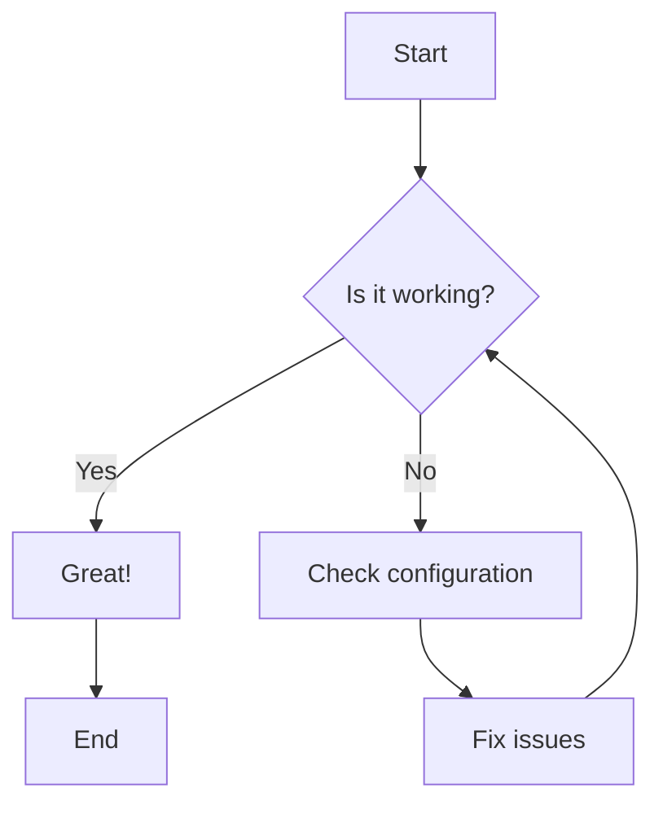
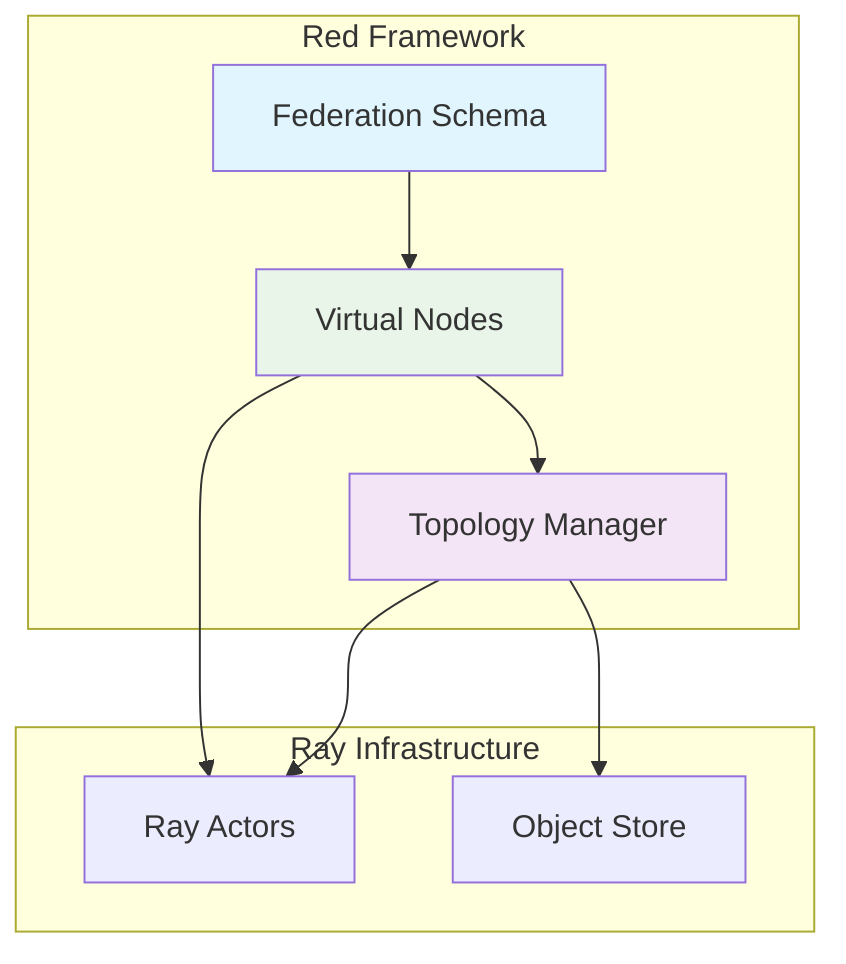
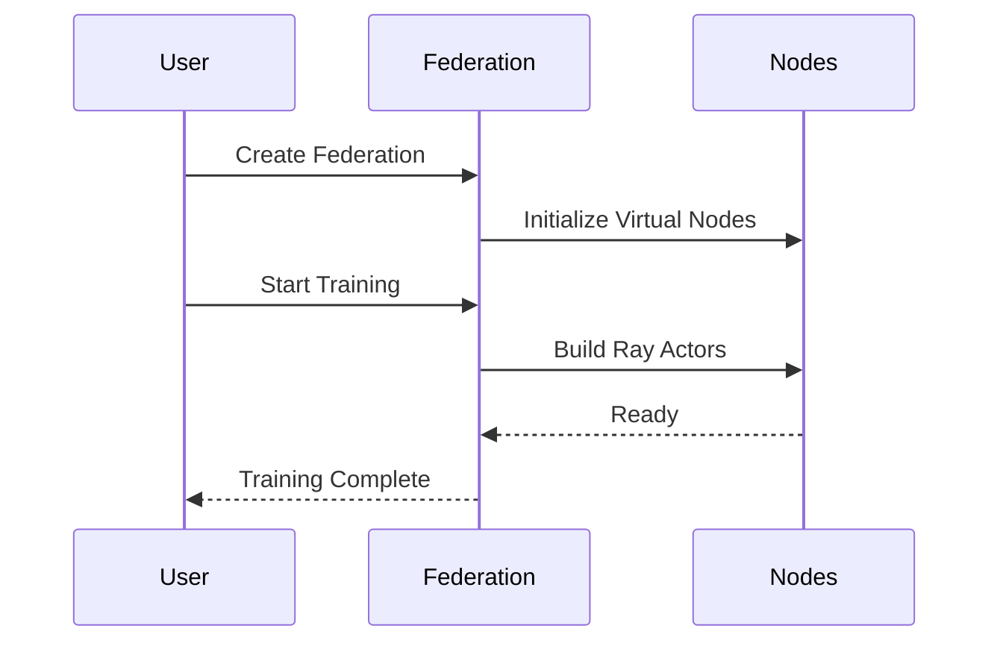
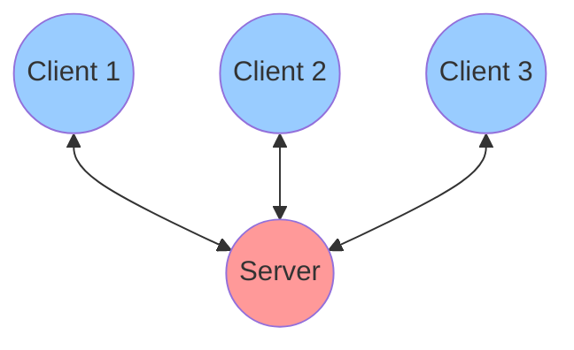

# Diagram Test Page

This page tests whether diagrams are rendering correctly on the website.

## Simple Flow Chart

## System Architecture

## Sequence Diagram

## Network Topology

If you can see the diagrams above, then Mermaid is working correctly! 