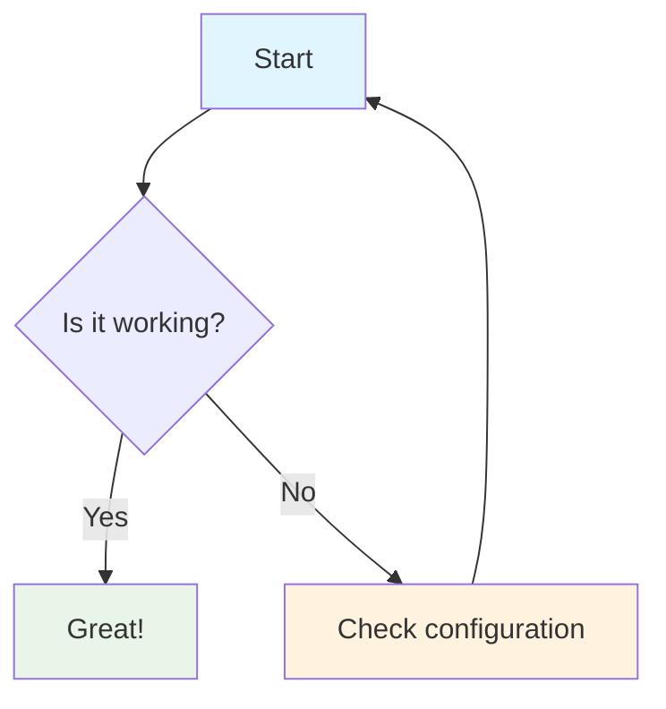
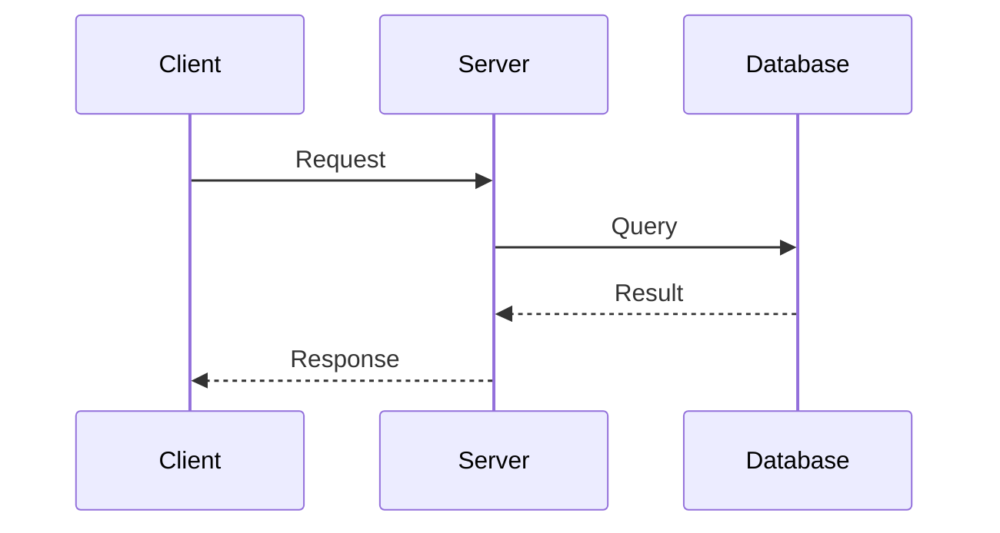

# Test Page

This is a simple test page to verify that Jekyll, the Minima theme, and Mermaid diagrams are working correctly.

## Current Configuration

- Theme: Minima
- Jekyll version: GitHub Pages
- Base URL: {{ site.baseurl }}
- Site URL: {{ site.url }}

## Test Elements

### Text Formatting
- **Bold text**
- *Italic text*
- `Code text`

### Lists
1. First item
2. Second item
3. Third item

### Code Block
```python
def hello_world():
    print("Hello, World!")
```

### Mermaid Diagram Test

Here's a simple Mermaid diagram to test if diagrams are rendering:



### Another Diagram



If you can see this page with proper styling and the diagrams are rendering correctly, the Jekyll configuration is working! 