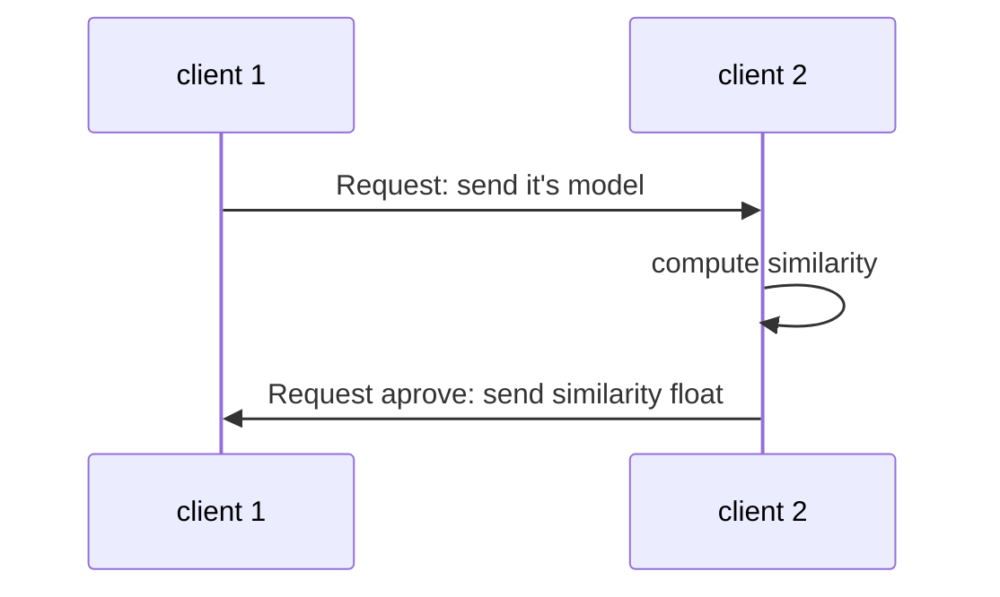

# Similarities

## Distributed Cosine Similarity

```mermaid
sequenceDiagram
    client 1 ->>client 2: Request: send it's model
    client 2 ->>client 2: compute similarity
    client 2 ->> client 1: Request aprove: send similarity float

```